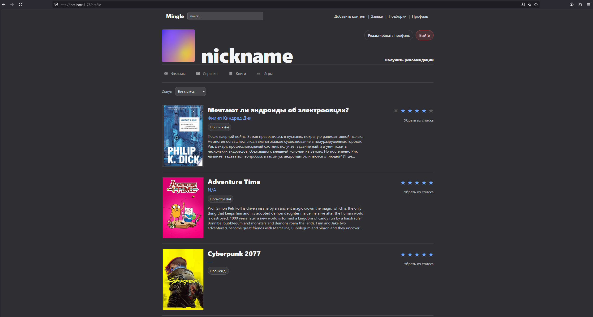
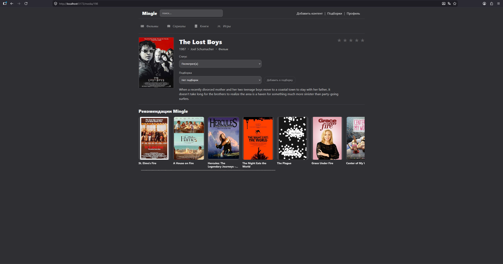
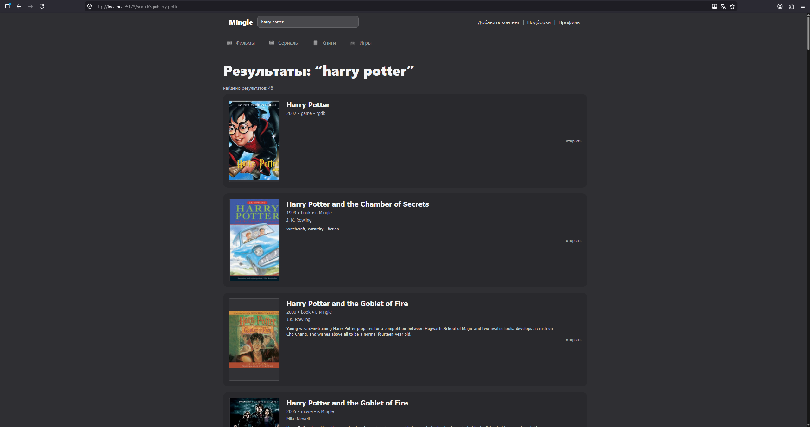
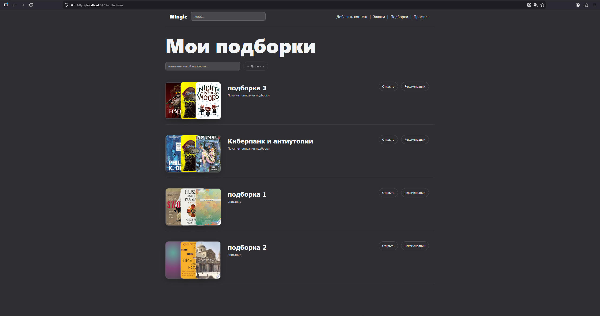
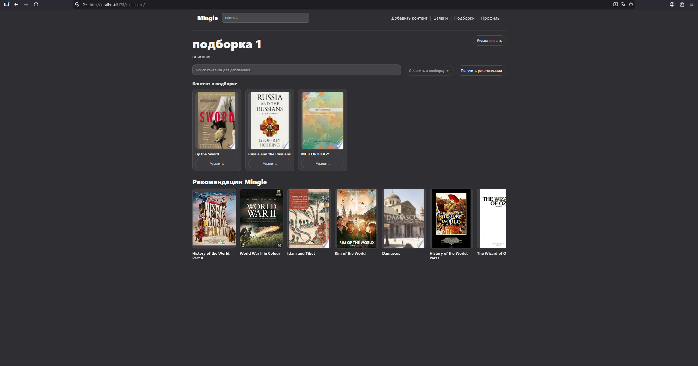
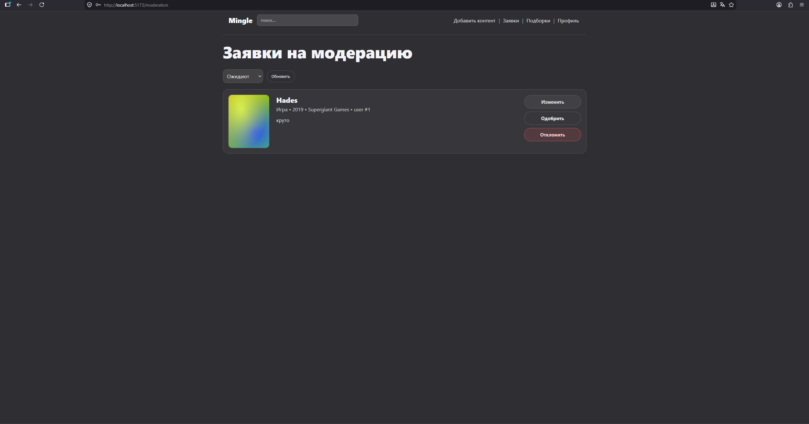

# Mingle

**Mingle** — веб-система рекомендаций для разнообразного медиаконтента: фильмов, сериалов, книг и видеоигр.

Система позволяет пользователю вести единый профиль медиапотребления, отмечать изученный контент, выставлять оценки, создавать подборки и получать рекомендации по профилю, отдельному произведению или подборке.

## Основные возможности

- регистрация и вход пользователя;
- просмотр каталога медиаконтента;
- поиск контента в локальном каталоге и внешних источниках;
- импорт найденного контента в систему;
- просмотр карточки фильма, сериала, книги или игры;
- сохранение пользовательского статуса и оценки;
- просмотр истории активности в профиле;
- создание и редактирование подборок;
- добавление контента в подборки;
- получение рекомендаций:
  - по профилю пользователя;
  - по конкретной единице медиаконтента;
  - по пользовательской подборке;
- модерация пользовательских заявок на добавление контента.

## Скриншоты

### Профиль пользователя



### Карточка медиаконтента



### Поиск медиаконтента



### Пользовательские подборки



### Рекомендации по подборке



### Модерация заявок



## Запуск проекта

Для запуска требуется установленный Docker и Docker Compose.

1. Склонировать репозиторий:
```
git clone https://github.com/dzzgzztd/mingle.git 
cd mingle
```
2. На основе .env.example составить .env файл, заполнив необходимые поля

3. Запустить систему:
```
docker compose up -d --build
```

4. Открыть приложение в браузере:
```
http://localhost:5173
```

## Используемые технологии

### Клиентская часть

- TypeScript;
- React;
- React Router;
- Axios;
- CSS Modules.

### Серверная часть

- Go;
- Gin;
- GORM;
- PostgreSQL;
- Redis;

### Рекомендательная подсистема

- Python;
- FastAPI;
- scikit-learn;

### Развертывание

- Docker;
- Docker Compose.

## Архитектура

Система состоит из нескольких компонентов:

- `frontend` — клиентское веб-приложение;
- `backend` — серверное REST API;
- `recommendation_service` — отдельный сервис формирования рекомендаций;
- `postgres` — база данных;
- `redis` — кэш поисковых результатов.
